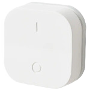
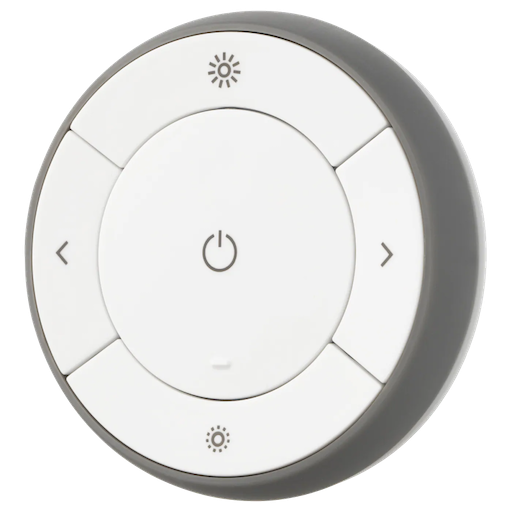

# Home Assistant Blueprints

## 🟡 IKEA ON/OFF Switch (E1743)

A blueprint to control lights using the **IKEA Tradfri ON/OFF Switch (E1743)**.  
Supports on/off, dimming via long press, customizable transition timing.

Click the button below to import this blueprint directly into your Home Assistant instance.

## 🟡 IKEA Remote Dimmer (E1810)

A blueprint to control lights using the **IKEA Tradfri Remote Dimmer (E1810)**.  
Supports on/off, dimming via long press, scene control, and customizable transition timing.

Click the button below to import this blueprint directly into your Home Assistant instance.

